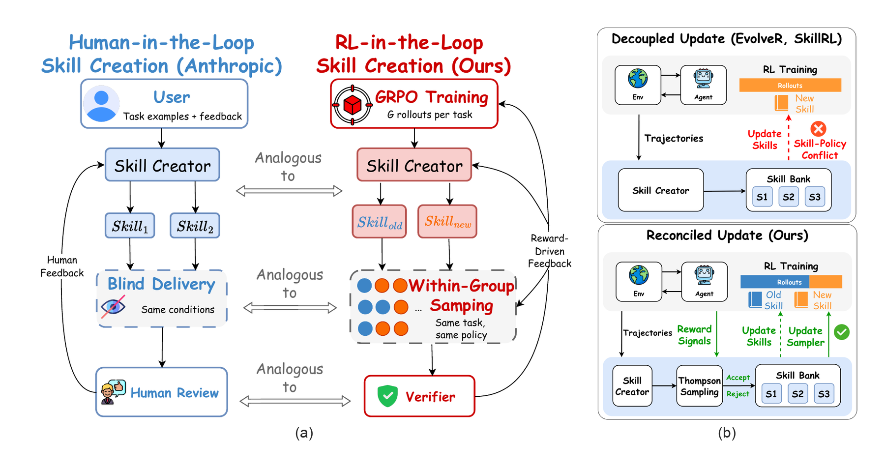

# ReSkill

*An easy-to-configure, extensible veRL extension that brings the Anthropic
Skill Creator into agentic RL training. Full control over skill versioning,
sampling, bundle testing, and skill-policy co-evolution.*

Official code for the paper:
**ReSkill: Reconciling Skill Creation with Policy Optimization in Agentic RL**.

[](https://arxiv.org/abs/2606.01619) [](https://amazon-science.github.io/reskill/) [](https://github.com/verl-project/verl/tree/d62da4950573d7a4b7ef2362337952e7ab59e78d) [](LICENSE)

---

## 🔥 News

- **[2026-06]** 🎉 Paper and codebase are now public. More are on the way... stay tracked!

---

## 🧩 System Overview

<p align="center">
  
</p>

<p align="center">
  <em>(a) Inspired by Anthropic's human-in-the-loop Skill Creator, ReSkill recasts skill creation as an RL-in-the-loop process. (b) Compared with decoupled skill-update methods, ReSkill exposes a highly configurable loop for jointly evolving skills and policies.</em>
</p>

ReSkill combines three pieces:

- **RL training with per-turn skill customization**: veRL handles distributed RL, while
  ReSkill follows the [verl-agent](https://github.com/langfengq/verl-agent)
  design of decomposing multi-turn agent rollouts and adds skill loading into
  each turn.
- **RL-in-the-loop skill creation**: ReSkill adapts the structure of
  [Anthropic's skill creator](https://github.com/anthropics/skills/blob/main/skills/skill-creator/SKILL.md)
  into an RL feedback loop for analyzing rollout experience and proposing skill
  updates during training.
- **Skill versioning and sampling**: ReSkill tracks skill versions, loads active
  skills, samples/testing skill bundles, and supports skill-policy
  co-evolution over training.

## ⚙️ Installation

```bash
git clone https://github.com/amazon-science/reskill.git
cd reskill
git submodule update --init --recursive verl
pip install -e .
```

Install only the benchmark and backend extras you need:

```bash
pip install -e ".[<env>,vllm]"
```

Validated stack pins are recorded under `requirements/`.

The current benchmark extras are `alfworld`, `search`, and `scienceworld`.
Additional environment support will be added over time.

## 🚀 Usage

Prepare data for an environment:

```bash
python scripts/data_prep/prepare_<env>.py --output_dir data/<env>
```

Run training:

```bash
python scripts/train.py --config-name <env>
```

Concrete configs live under `configs/`, and cluster launch examples live under
`scripts/launch/`.

## 🛠️ Customize ReSkill

ReSkill is designed so both sides of the co-evolution loop can be customized.

- **Policy side**: customize the environment, rollout format, action projection,
  rewards, group rollout settings, and backend profiles.
- **Skill side**: customize skill-generation prompts, trigger behavior, active
  skill budgets, version testing/sampling, and skill library persistence.

## 📢 Release Note

> This codebase is under active restructuring and testing as we work toward a stable release. Thank you for your patience and interest!

## 🗺️ Roadmap

- Track newer veRL releases.
- Add SGLang rollout backend support.
- Add backend config profiles for vLLM and SGLang.
- Expand validated environment examples.

## 🙏 Acknowledgements

We thank the contributors to [veRL](https://github.com/volcengine/verl),
[verl-agent](https://github.com/langfengq/verl-agent), and
[Anthropic Skill Creator](https://github.com/anthropics/skills/blob/main/skills/skill-creator/SKILL.md)
for their open-source foundations and inspiration, which ReSkill builds upon.

## 📄 License

Apache 2.0

## 📚 Citation

If you find this work helpful, please kindly consider citing our paper and
starring the repository.

```bibtex
@article{he2026reskill,
  title={ReSkill: Reconciling Skill Creation with Policy Optimization in Agentic RL},
  author={He, Zelin and Lin, Haotian and Han, Boran and Zhu, Wei and Fang, Haoyang and Wang, Bernie and Zhu, Xuan and Li, Runze and Reimherr, Matthew},
  journal={arXiv preprint arXiv:2606.01619},
  year={2026}
}
```
